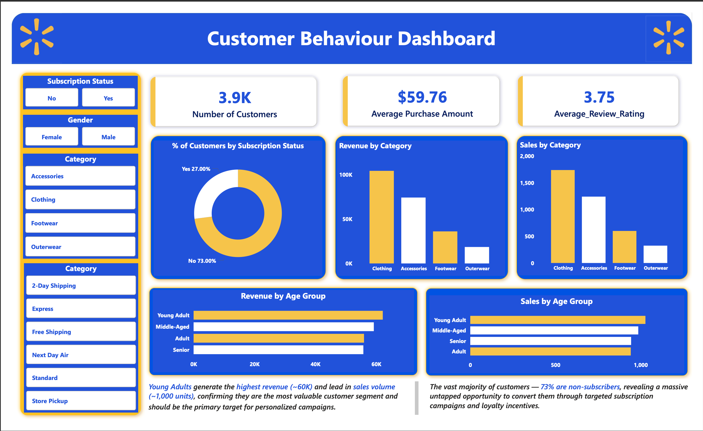

# 🛍️ Customer Shopping Behavior Analysis

### End-to-End Data Analytics Project using Python, PostgreSQL, SQL & Power BI

> Transforming raw retail transaction data into actionable business insights through data cleaning, SQL analysis, and interactive Power BI dashboards.

## 📖 Project Overview

This project analyzes customer shopping behavior using transactional data from **3,900 purchases** across multiple product categories. The objective is to identify purchasing trends, customer segments, subscription behavior, and product performance to support data-driven business decisions.

The project follows a complete analytics workflow—from data preparation in **Python**, business analysis using **PostgreSQL** and **SQL**, to interactive visualization with **Power BI**—providing meaningful insights that can help improve customer engagement, optimize marketing strategies, and enhance business performance.

## 🎯 Business Problem

Retail organizations generate large volumes of customer transaction data, but transforming this information into meaningful business insights remains a significant challenge. Decision-makers require a clear understanding of customer purchasing behavior, product preferences, subscription trends, and revenue patterns to make informed strategic decisions.

This project addresses that challenge by analyzing customer shopping data to identify purchasing trends, evaluate customer engagement, and uncover opportunities to improve marketing effectiveness, customer retention, and overall business performance.

## 🎯 Project Objectives

- Analyze customer purchasing behavior across different demographics.
- Identify revenue trends across product categories.
- Evaluate customer subscription and loyalty patterns.
- Measure product performance and customer preferences.
- Build an interactive dashboard for business stakeholders.
- Generate actionable recommendations to improve customer engagement and revenue.

---

# 📊 Dashboard Preview

> **Interactive Power BI dashboard providing insights into customer purchasing behavior, revenue trends, subscription analysis, and product performance.**

<p align="center">

</p>

---

## 🛠️ Tech Stack


---

# 📂 Dataset Information

| Attribute | Details |
|----------|---------|
| Dataset | Customer Shopping Behavior |
| Records | 3,900 |
| Columns | 18 |
| Missing Values | 37 (Review Rating) |
| Domain | Retail Analytics |

---

# ❓ Business Questions

The analysis focuses on answering key business questions, including:

- What is the total revenue generated by male vs. female customers?
- Which customers used discounts while spending above the average purchase amount?
- Which products received the highest customer ratings?
- How does purchase amount vary across shipping methods?
- Do subscribed customers generate more revenue than non-subscribers?
- Which products receive the highest percentage of discounted purchases?
- How can customers be segmented based on previous purchase behavior?
- Which products are the most purchased within each category?
- Are repeat buyers more likely to subscribe?
- Which age group contributes the highest revenue?

# 💡 Key Business Insights

- Young Adults generated the highest revenue, making them the most valuable customer segment.
- Clothing was the top-performing product category in both revenue and sales volume.
- Approximately 73% of customers were non-subscribers, highlighting a significant opportunity for subscription growth.
- The average purchase amount was $59.76, indicating consistent customer spending across product categories.
- Customers gave an average review rating of 3.75/5, suggesting overall positive satisfaction with room for improvement.

# 🚀 Business Recommendations

- Launch targeted subscription campaigns for non-subscribers.
- Focus marketing efforts on the Young Adult customer segment.
- Increase investment in high-performing product categories through targeted inventory planning and promotional campaigns to maximize revenue potential.
- Implement personalized marketing campaigns based on historical purchasing behavior to improve customer retention and increase repeat purchases.
- Improve customer satisfaction by monitoring lower-rated products.

## 🔄 Analytics Workflow

```text
Raw CSV Dataset
        │
        ▼
Data Cleaning & Preprocessing (Python)
        │
        ▼
Feature Engineering & Validation
        │
        ▼
PostgreSQL Database
        │
        ▼
SQL Business Analysis
        │
        ▼
Power BI Dashboard
        │
        ▼
Business Insights & Recommendations
```

---

## 👨‍💻 Author

**Dev Chhabra**

Data Analyst passionate about transforming raw data into meaningful business insights using Python, SQL, PostgreSQL, Excel, and Power BI.

📫 LinkedIn: [Dev Chhabra](https://www.linkedin.com/in/devchhabra108/)

⭐ If you found this project useful, consider giving it a star.
